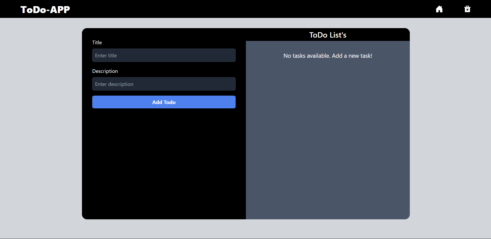
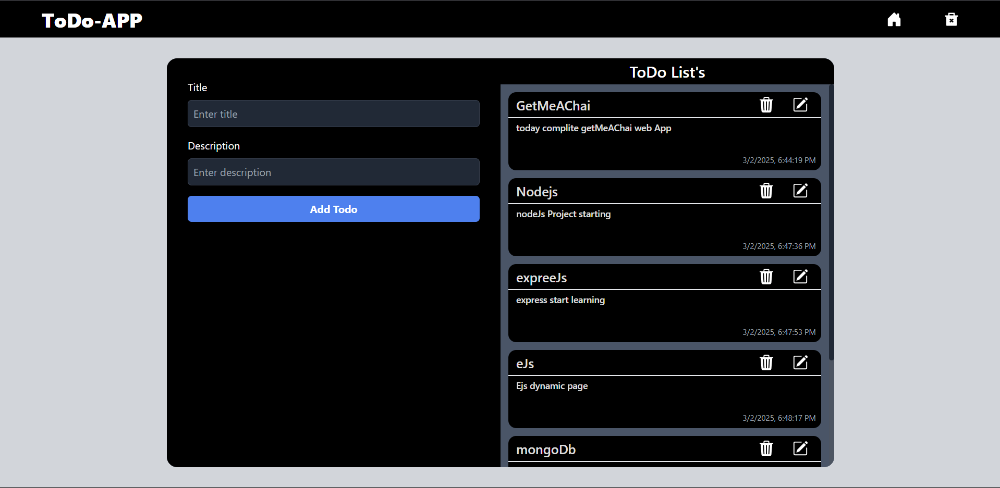
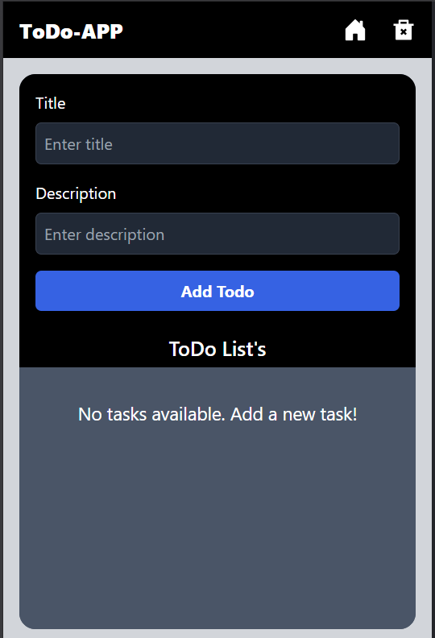
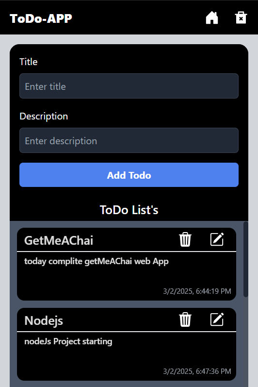

# React-ToDo-App

A simple, user-friendly, and efficient **To-Do App** built using **React + Vite**. This project allows users to seamlessly create, edit, delete, and track tasks, making it a perfect productivity companion.

The app focuses on **performance, responsiveness, and usability**, offering a smooth experience with a clean and intuitive interface.

## ✨ Why This To-Do App?

Managing tasks efficiently is essential for productivity, and this app provides the following advantages:

- **Fast & Lightweight:** Built with Vite for optimized performance and quick load times.
- **Easy to Use:** Simple and minimal UI with an intuitive workflow.
- **Persistent Storage:** Saves tasks in local storage so that they remain even after a page refresh.
- **Modern UI & UX:** Styled with Tailwind CSS to provide a sleek and responsive design.
- **Customizable & Scalable:** Modular React components allow easy customization and future expansion.

## 🚀 Key Features

### ✅ Task Management

- Add tasks quickly with a single input field.
- Edit existing tasks without the need to delete and re-enter them.
- Delete tasks effortlessly when they are no longer needed.


### 💾 Persistent Data with Local Storage

- Tasks are stored locally in the browser, ensuring they remain available even after refreshing the page.
- No need for external databases or accounts—everything is saved directly on the user's device.

### 📱 Responsive & Modern UI

- Built with **Tailwind CSS** for a modern, aesthetically pleasing design.
- Fully responsive across **mobile, tablet, and desktop** devices.
- Supports **dark mode** for a comfortable user experience in low-light environments.

### ⚡ Fast Performance & Developer-Friendly

- Uses **Vite** for a blazing-fast development experience and optimized production builds.
- Hot Module Replacement (HMR) for instant feedback during development.
- Simple and modular **React components** for better code reusability and maintainability.

---

This To-Do App is perfect for both **personal task management** and as a **learning project** for developers looking to understand React, state management, and local storage. 🚀

## 📂 Project Folder Structure

```
📂 Cwh_v114_ToDoList_App_Tailwind
├── 📂 node_modules         # Node packages
├── 📂 public               # Static assets
│   ├── 📂 images          # Image assets
│   │   ├── 📜 vite.svg
├── 📂 src                  # Source files
│   ├── 📂 assets           # Additional assets
│   ├── 📂 components       # Reusable React components
│   │   ├── 📜 NavBar.jsx
│   │   ├── 📜 TodoCard.jsx
│   │   ├── 📜 TodoInput.jsx
│   ├── 📜 App.jsx          # Main app component
│   ├── 📜 main.jsx         # Application entry point
│   ├── 📜 index.css        # Global styles
├── 📜 .gitignore           # Git ignore file
├── 📜 eslint.config.js     # ESLint configuration
├── 📜 index.html           # Main HTML file
├── 📜 package-lock.json    # Lock file for dependencies
├── 📜 package.json         # Project dependencies & scripts
├── 📜 postcss.config.js    # PostCSS configuration
├── 📜 README.md            # Project documentation
├── 📜 tailwind.config.js   # Tailwind CSS configuration
├── 📜 vite.config.js       # Vite configuration
```

## 📸 Screenshots of React-ToDo-App

<figure>
  
  <figcaption>ReactToDo: Todo When empty.</figcaption>
</figure>

<figure>
  
  <figcaption>ReactToDo: when user add todo card show.</figcaption>
</figure>

## small devices


&nbsp; &nbsp;


## 🛠 Installation

1. Clone the repository:
   ```sh
   git clone https://github.com/abhishekh1516techboy/React-ToDo-App.git
   cd React-ToDo-App
   ```
2. Install dependencies:
   ```sh
   npm install
   ```
3. Start the development server:
   ```sh
   npm run dev
   ```
4. Open your browser and go to `http://localhost:5173`

## 📦 Build

To create a production build:

```sh
npm run build
```

## 🧹 Linting

Ensure code quality with ESLint:

```sh
npm run lint
```

## 🤝 Contributing

Feel free to fork this repository and submit pull requests. Contributions are always welcome!

## 📜 License

This project is licensed under the [MIT License](LICENSE).

---

**Happy Coding!** 🎯
